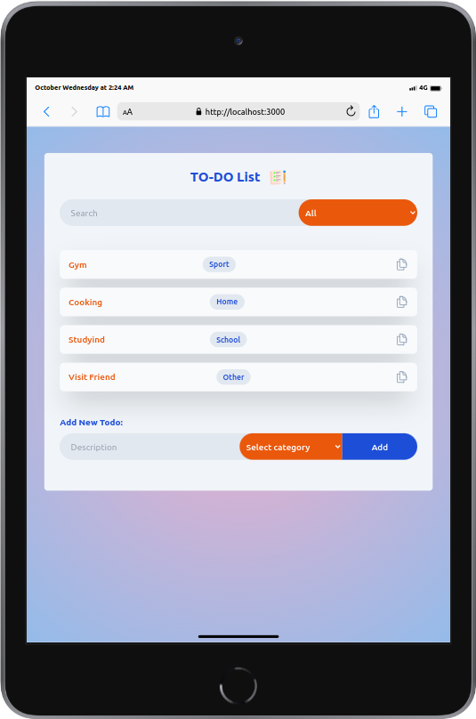
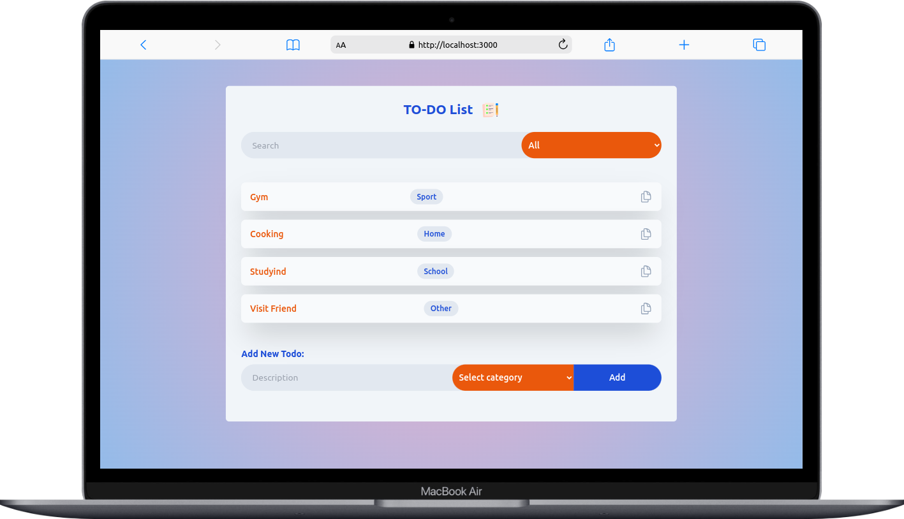

<div align="center">


  <h3>TO-DO</h3>

</div>

<!-- TABLE OF CONTENTS -->

# 📗 Table of Contents

- [📖 About the Project](#about-project)
  - [🛠 Built With](#built-with)
    - [Tech Stack](#tech-stack)
    - [Key Features](#key-features)
  - [🚀 Live Demo](#live-demo)
- [💻 Getting Started](#getting-started)
  - [Prerequisites](#prerequisites)
  - [Setup](#setup)
  - [Install](#install)
  - [Usage](#usage)
- [👥 Authors](#authors)
- [🤝 Contributing](#contributing)
- [⭐️ Show your support](#support)
- [📝 License](#license)

<!-- PROJECT DESCRIPTION -->

# 📖 TO-DO <a name="about-project"></a>

**TO-D0 App** is a user-friendly React application designed to simplify task management. With the ability to add, categorize, and search for tasks, the app ensures your to-do list is always at your fingertips. Your tasks are stored securely in your browser's localStorage, meaning you won't lose them, even if you refresh the page or return later. Try Todo App now to enjoy efficient and hassle-free task organization.

## APP SCREENSHOTS
<div heigth>
  
  
</div>

<div>
  
</div>

## 🛠 Built With <a name="built-with"></a>

### Tech Stack <a name="tech-stack"></a>

  <ul>
    <li><a href="https://reactjs.org/">React.js</a></li>
     <li><a href="https://www.typescriptlang.org/">Typescript</a></li>
      <li><a href="https://tailwindcss.com/docs/installation">TailwindCSS</a></li>
  </ul>

<!-- Features -->

### Key Features <a name="key-features"></a>

- **Add new Todo**
- **Todo Filters**
- **Todos are stored in LocalStorage**

<!-- LIVE DEMO -->

## 🚀 Live Demo <a name="live-demo"></a>

- [Live Demo Link](coming soon...)

<!-- GETTING STARTED -->

## 💻 Getting Started <a name="getting-started"></a>

To get a local copy up and running, follow these steps.

### Prerequisites

In order to run this project you need:
 
 - Code editor
 - Browser

### Setup

Clone this repository to your desired folder:

```sh
  git clone https://github.com/levy002/todo_ts
```

### Install

Install this project with:

```sh
  cd <directory>
  npm install
```

### Usage

To run the project, execute the following command:


```sh
  npm start
```

<!-- AUTHORS -->

## 👥 Authors <a name="authors"></a>

👤 **LEVY UKWISHAKA**

- GitHub: [@levy002](https://github.com/levy002)
- Twitter: [@levy_ukwishaka](https://twitter.com/levy_ukwishaka)
- LinkedIn: [@levy-ukwishaka](https://www.linkedin.com/in/levy-ukwishaka/)

<!-- CONTRIBUTING -->

## 🤝 Contributing <a name="contributing"></a>

Contributions, issues, and feature requests are welcome!

Feel free to check the [issues page](../../issues/).

<!-- SUPPORT -->

## ⭐️ Show your support <a name="support"></a>

If you like this project please leave ⭐️ 

<!-- LICENSE -->

## 📝 License <a name="license"></a>

This project is [MIT](./LICENSE) licensed.

